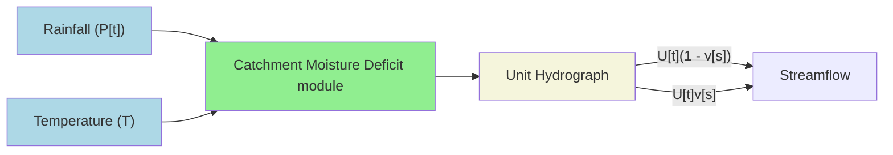
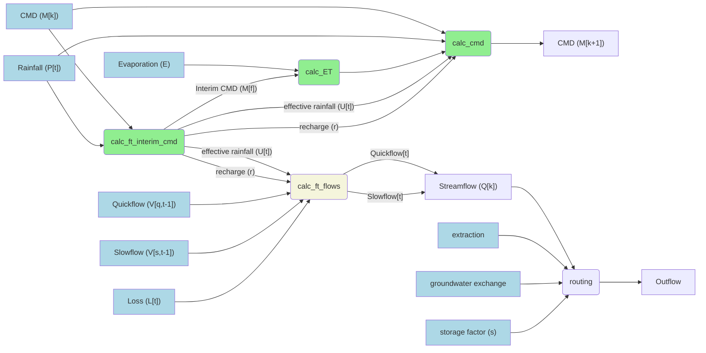

## Primer

IHACRES converts rainfall and temperature data into estimations of runoff at catchment scale.

The model can be conceptualized as taking the following structure:



`IHACRES_nim` provides functions which may be composed to represent different formulations of the IHACRES_CMD model.

All formulations require the following four parameters (with usual bounds)

| Parameter 	| Bounds             	| Description                            	|
|-----------	|--------------------	|----------------------------------------	|
| $d$       	| $10 \le d \le 550$ 	| flow threshold                         	|
| $d_2$     	| $0 < d_2 \le 10$    | multiplicative factor applied to $d$   	|
| $e$       	| $0.1 \le e \le 1.5$ | Temperature to PET conversion factor   	|
| $f$       	| $0.01 \le f \le 3$ 	| Plant stress threshold, applied to $d$ 	|


A six parameter implementation (as in IHACRES Classic) can be achieved by fixing $d_2 = 2.0$, with the following additional parameters:

| Parameter | Bounds             	| Description                            	                          |
|-----------|--------------------	|-----------------------------------------------------------------	|
| $\tau_q$  | $0.5 \le d \le 10$ 	| Time constant value controlling how fast quickflow recedes      	|
| $\tau_s$  | $10 < d_2 \le 350$  | Time constant value that governs the speed of slowflow recession 	|
| $v_s$     | $0 < v_s \le 1$     | Partitioning factor separating slow and quick flow contributions 	|

An eight parameter, bilinear, implementation replaces the above parameters with the following:

| Parameter 	| Bounds        | Description                            	                          |
|-----------	|---------------|-----------------------------------------------------------------	|
| $a$      | see note below   | Time constant value controlling how fast quickflow recedes      	|
| $b$      | see note below   | Time constant value that governs the speed of slowflow recession 	|
| $\alpha$ | $0 < v_s \le 1$  | Partitioning factor separating slow and quick flow contributions 	|
| $s$      | $0.1 < s \le 10$ | storage factor |


Note: Appropriate values of $a$ and $b$ can be context specific. Nevertheless, to give some guidance, these values can be set between 0.1 and 10.0 for $a$ and between 0.001 and 0.1 for $b$.

Delving into the implementation, the flow between parameters (light blue) and functions (rounded boxes) can be seen in the diagram below.



Here, 
 - rounded boxes represent functions
 - blue boxes represent input factors
 - green functions indicate those relevant to the non-linear loss module
 - the beige function is the relevant unit hydrograph function

Use of any component function may be replaced with an equivalent. For example, `calc_ft_interim_cmd` may be replaced by any other `calc_*_interim_cmd` function, so long as the correct parameters are passed in. See [documentation](https://connectedsystems.github.io/ihacres_nim/ihacres.html) for details.

An example, in the procedural style, is shown below for the Python language:

```python
from ctypes import cdll

# Attach DLL
IHACRES = cdll.LoadLibrary("./lib/ihacres.so")

# Assuming all input factors are already loaded/available
# Compare with the notated parameter list above
mf, U, r = IHACRES.calc_ft_interim_cmd(mk, P, d, d2, alpha)

ET = IHACRES.calc_ET(e, E, mf, f, d)

cmd = IHACRES.calc_cmd(mk, P, ET, U, r)

Vq, Vs, outflow = IHACRES.calc_ft_flows(Vq_1, Vs_1, U, r, catchment_area, a, b, loss)

# if node routes to another node
volume, outflow = IHACRES.routing(cmd, s, inflow, outflow, extraction, gw_exchange)
```